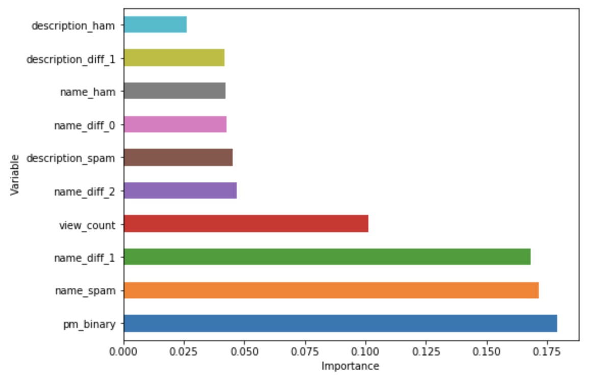

# Rocketpunch project

## 1. 분석 목적
계정의 스팸 여부 판단

## 2. 데이터
- 스팸 계정 369개, 정상 계정 69297개로 전체 데이터의 0.5%가 스팸인 unbalanced 데이터  
- 전체 데이터를 6 : 2 : 2로 나누어 training, validation, test로 이용
- 결측치가 대부분

## 3. 전처리
**blog, cover, employee_count, exit_type, found_date, github, googleplus, instagram, kakao_story, logo, phone, pinterest, twitter, yellow_id, youtube**  
- NaN이면 1 아니면 0인 binary 변수로 변환

**can_military_service**  
- 범주가 3개인 categorical 변수 -> one-hot encoding

**description, name**  
- training 데이터의 스팸 계정에서 사용 된 단어를 몇 개 포함하고 있는지 나타내는 새로운 변수 '변수이름_spam' 추가 -> 0 에서 1 사이로 표준화  
- training 데이터의 정상 계정에서 사용 된 단어를 몇 개 포함하고 있는지 나타내는 새로운 변수 '변수이름_ham' 추가 -> 0 에서 1 사이로 표준화  
- '변수이름_spam'이 '변수이름_ham'보다 크면 1 아니면 0인 binary 변수 '변수이름_diff' 추가  
- 새로운 변수 추가 후 삭제

**homepage**  
- 글자수를 나타내는 새로운 변수 'homepage_n' 추가 후 삭제 -> 0 에서 1 사이로 표준화  

**overview**  
- 글자수를 나타내는 새로운 변수 'overview_n' 추가 -> 0 에서 1 사이로 표준화   
- training 데이터의 스팸 계정에서 사용 된 단어를 몇 개 포함하고 있는지 나타내는 새로운 변수 'overview_spam' 추가 -> 0 에서 1 사이로 표준화  
- training 데이터의 정상 계정에서 사용 된 단어를 몇 개 포함하고 있는지 나타내는 새로운 변수 'overview_ham' 추가 -> 0 에서 1 사이로 표준화  
- 'overview_spam'이 'overview_ham'보다 크면 1 아니면 0인 binary 변수 'overview_diff' 추가  
- 새로운 변수 추가 후 삭제

**permalink**  
- numeric이면 1 아니면 0인 binary 변수 'pm_binary'로 변환

**viewcount**  
- 0 에서 1 사이로 표준화  

**num_nan**  
- 새로운 변수로 각 observation의 NaN 개수를 나타냄 -> 0 에서 1 사이로 표준화  

## 4. 분석 방법
**Random forest 이용**  
1. Hyperparameter tuning이 쉬움  
2. Computing time이 짧음  
3. Able to perform as well as the more complex model  

unbalanced 데이터이기 때문에 y = 1(계정은 스팸이다)를 예측하는 것이 중요  
precision과 recall의 가중평균인 f1을 최대로 하는 hyperparameter를 10-folds cross validation를 이용해 찾고자 하였음 

## 5. 분석 결과

|        | 0     | 1     |
| ------ |:-----:|:-----:|
| 0      | 13415 | 444   |
| 1      | 42    | 32    |

오분류율 = 3.49%  
precision = 6.72%  
recall = 43.24%  
**f1 = 11.64%%**  

**name_spam, name_diff, pm_binary, view_count, description_diff 등이 중요한 변수로 사용 됨**  
- name_spam : training 데이터의 스팸 계정 name에 사용 된 단어를 몇 개 포함하고 있는지 나타내는 변수  
- name_diff : name_spam이 name_ham보다 큰 값을 가지는지 나타내는 변수
- pm_binary : numeric 여부를 나타내는 변수  
- description_diff : name_description이 name_description보다 큰 값을 가지는지 나타내는 변수

## 6. 추가 분석
### Under sampling

|        | 0     | 1     |
| ------ |:-----:|:-----:|
| 0      | 13359 | 500   |
| 1      | 40    | 34    |

정상 데이터의 60%만 이용  
recall은 높아졌지만 precision은 낮아짐
